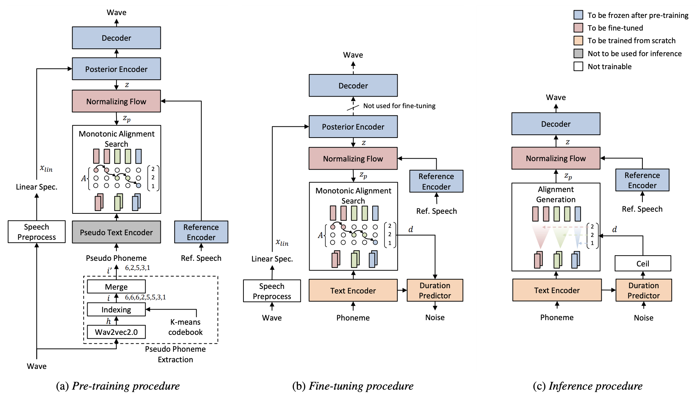

# TransferTTS (Zero-shot VITS) - PyTorch Implementation

Unofficial PyTorch Implementation of [Transfer Learning Framework for Low-Resource Text-to-Speech using a Large-Scale Unlabeled Speech Corpus](https://arxiv.org/abs/2203.15447). Most of codes are based on [VITS](https://github.com/jaywalnut310/vits)

0. MelStyleEncoder from [StyleSpeech](https://arxiv.org/abs/2106.03153) is used instead of the reference encoder.
1. Implementation of untranscribed data training is omitted. 
2. Sampling rate is set to 22050Hz.

<p align="center">
    
</p>

# Branch
- [x] TransferTTS (Zero-shot) (`master` branch)
- [TODO] TransferTTS (Few-shot) (`fewshot` branch)

## Pre-requisites (from VITS)
0. Python >= 3.6
0. Clone this repository
0. Install python requirements. Please refer [requirements.txt](requirements.txt)
    1. You may need to install espeak first: `apt-get install espeak`
0. Build Monotonic Alignment Search and run preprocessing if you use your own datasets.
```sh
# Cython-version Monotonoic Alignment Search
cd monotonic_align
python setup.py build_ext --inplace
```
## Datasets
- [Pretraining: LibriTTS](https://research.google/tools/datasets/libri-tts/): a multi-speaker English dataset containing 585 hours of speech by 2456 speakers.
- []
## Preprocessing
 
Run 
```
python prepare_wav.py --data_path [LibriTTS DATAPATH]
```
for some preparations.

## Training

Train your model with
```
python train_ms.py -c configs/libritts.json -m libritts_base
```

# References
- [TransferTTS](https://arxiv.org/abs/2203.15447)
- [VITS](https://arxiv.org/abs/2106.06103)
- [Meta-StyleSpeech](https://arxiv.org/abs/2106.03153)
